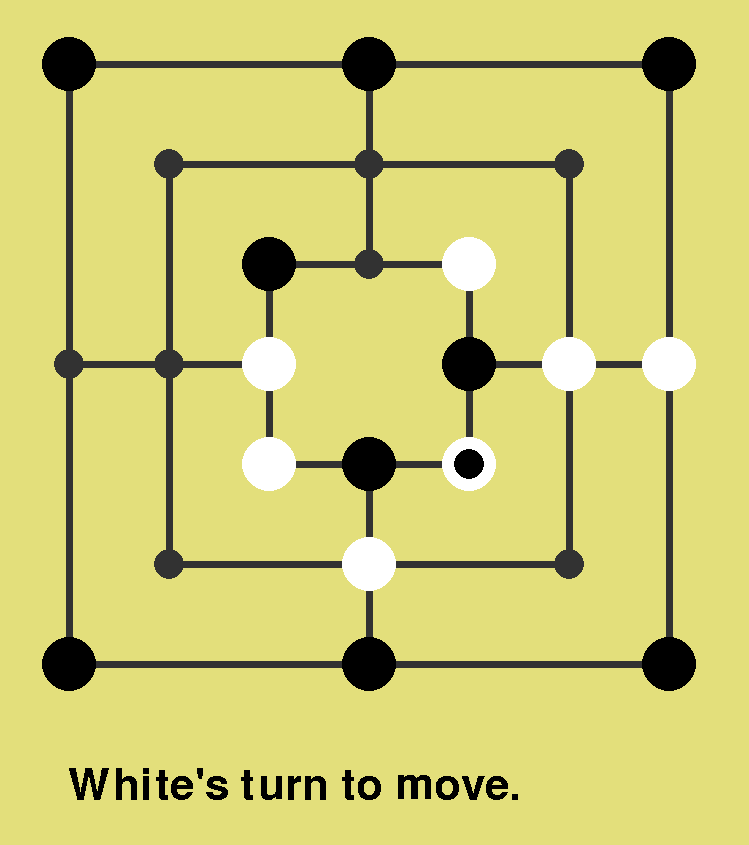

# Nine Men's Morris

### About ℹ️

Implementation of the classic "Nine Men's Morris" game in Python 🐍, using
[pygame](https://www.pygame.org/news) as part of the AI course @UniBuc 🏛️.
Features multiple options of play, including Player vs Player and against an AI
with multiple levels of difficulty.

<!--
-->
    <!---->
<!--
-->

    

The code is written in a single file and the result is _rough around the edges_
because it was written only in **one day** ⚡, since (for me) it was a last minute
assignment.

The resulting performance is satisfactory 👌🏼. I cannot win even on **medium**
difficulty, not to mention **hard**.

### Algorithm 🖥

The AI's "brain" 🧠 is based on a decision tree, the
[minmax](https://en.wikipedia.org/wiki/Minimax) algorithm and the [alpha-beta
pruning](https://en.wikipedia.org/wiki/Alpha%E2%80%93beta_pruning) optimization.

### Demo 📽

<!--
-->
    <!---->
<!--
-->

<!---->
<!--img[alt=Demo] { width: 200px; }-->
